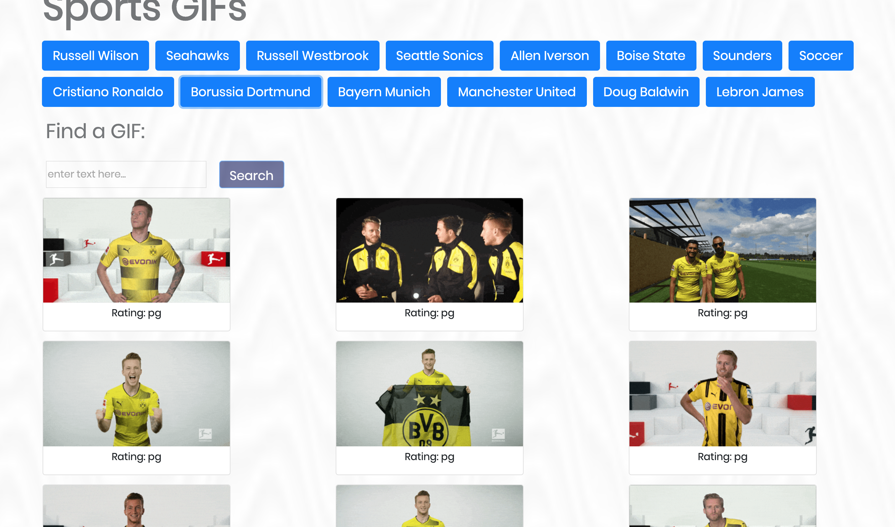
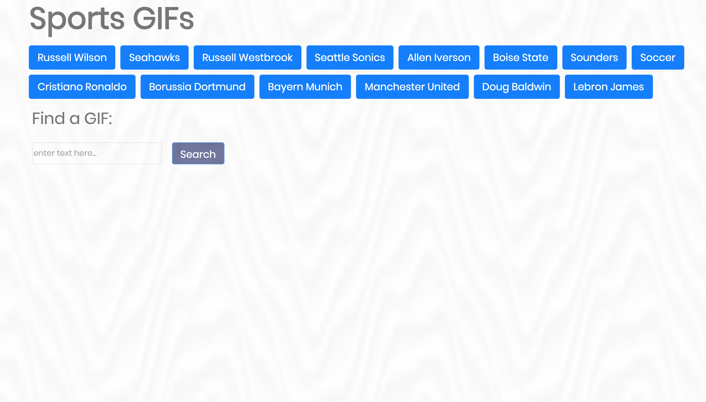

# giphy-app

This project will start out generating a group of buttons based off a pre-determined set of categories. There is a search bar that will allow the user to search any topic. Upon hitting search, the page will load that query by the user as a new button.
On each button click, the page will query giphy's API for 10 gifs of that particular button's reference and display them as a card with each GIF's rating underneath. The GIF's start out motionless and on click will animate the GIF.

live Application: https://brandonlublin.github.io/giphy-app/

###Creating the GIPHY App:
var topics = ['Russell Wilson', 'Seahawks', 'Russell Westbrook', 'Seattle Sonics', 'Allen Iverson', 'Boise State', 'Sounders', 'Soccer', 'Cristiano Ronaldo', 'Borussia Dortmund', 'Bayern Munich', 'Manchester United', 'Doug Baldwin', 'Lebron James'];

Create buttons using jQuery:
function createHtmlButtons() {
        for (let i = 0; i < topics.length; i++) {
            // $('.gifButtonArray').empty();
            var a = $('<button>');
            //add classes and attributes to each button from array
            a.addClass('btn btn-primary btn-lg');
            a.attr('data-name', topics[i]);
            a.attr('id', 'topicButtons');
            a.text(topics[i]);
        
            //append each button from array to the gifButtonArray div
            $('.gifButtonArray').append(a);
            $('#enter-text-box').empty();
        }
    }

Create search button on user entry using jQuery:

$('#searchButton').on('click', function(event){
        $('.gifButtonArray').empty();
        event.preventDefault();
        //pulls text from input box
        var newCategory = $('#enter-text-box').val().trim();
        //adds user input to topics array 
        topics.push(newCategory);
        
        //generates button user input
        createHtmlButtons();
        return false;
    })

## Built With
* [Bootstrap](https://getbootstrap.com/) - Frontend framework used
* [jQuery](https://jquery.com/) - JavaScript library used